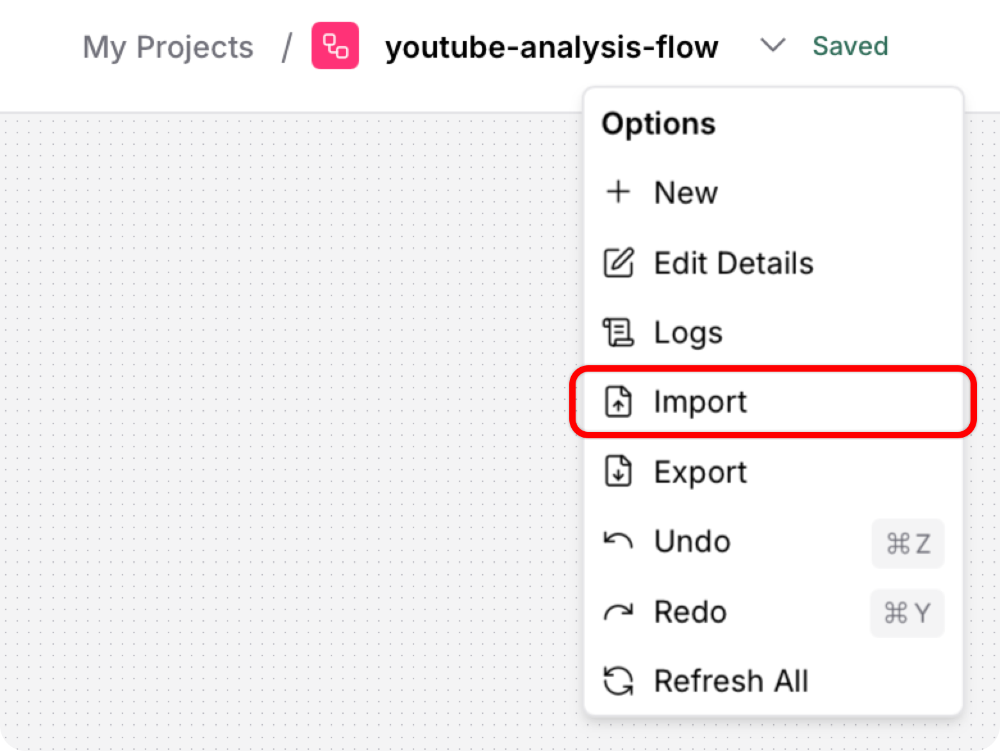

# 📺 YouTube Intelligence Flow – AI-Powered Video & Channel Analysis

Welcome to **YouTube Intelligence Flow**: an advanced AI pipeline designed with **LangFlow**, powered by **Gemini**, and integrated with the **YouTube API**.

This system allows users to input either a **YouTube video** or a **YouTube channel**, and receive a detailed, AI-generated analytical report including:

- Video content summary
- Audience sentiment analysis (inferred from stats or extracted from comments)
- Performance metrics interpretation
- Synthesis and recommendations

> ⚡ Ideal for content creators, marketers, researchers, or educators who want deep insight into YouTube content impact.

---

## 🌐 Technologies Used

- **LangFlow**: Visual LLM app builder (modular no-code/low-code pipeline)
- **Gemini API (Google AI)**: Large Language Model for analysis and report generation
- **YouTube Data API v3**: Video and channel metadata and statistics
- **Custom prompts & batch handling**: Designed for smart, structured outputs
- **Flask**: Beautiful website presentation

---

## 🧠 Project Overview

This flow provides two core analysis modes:

### ▶️ Video Mode

> Input: a single YouTube **video URL**

The system extracts:

- 📊 **Video statistics** (views, likes, duration, etc.)
- 📄 **Transcript** (if available)
- 💬 **Audience sentiment**, either:
- directly extracted from real comments (if feasible), or
- inferred via ratios (like/view, comment/view)

It then sends this data to an AI model, which returns a structured analysis covering:

- **Video Performance**
- **Content Summary**
- **Audience Reaction**
- **Cross-analysis (Synthesis)**
- **Recommendations**

📝 **Prompting & formatting** are carefully managed to ensure:

- Proper Markdown rendering (bold text, line breaks)
- Clear sectioning and readability

---

### 📈 Channel Mode

> Input: a full YouTube **channel URL**

The system gathers:

- Subscriber count
- Total views
- Number of videos
- Average engagement (likes/views/comments)
- Content themes (inferred from video titles and categories)

Since it's impossible to retrieve every comment from every video, the audience sentiment is **inferred from statistics** rather than extracted directly.

The output includes:

- **Channel Performance Overview**
- **Recurring Content Themes**
- **Inferred Audience Reception**
- **Synthesis**
- **Improvement Suggestions**

---

## 🗂️ Flow Structure

Your LangFlow pipeline includes:

- **Input Nodes**: User-entered YouTube URL, API keys
- **Condition Branches**: Detect if input is a video or a channel
- **API Components**:
- `YouTube Video Details`
- `YouTube Channel Stats`
- `YouTube Transcript`
- **Batch Run for Comment Analysis**: Runs sentiment logic on batches of comments if available
- **Prompt Assembly**: Combines all data into a well-structured message
- **Gemini Nodes**: Generate final text reports based on structured prompts
- **Chat Output**: Final formatted analysis visible to the user

📌 Includes custom post-it explanations and enhanced UX via visual cues and emoji labels.

---

## 📦 Installation & Requirements

> This project is intended to run in a **LangFlow environment** with the following setup:

- ✅ LangFlow installed locally or via Docker
- ✅ Gemini API key (Google AI Studio)
- ✅ YouTube Data API v3 key (Google Cloud Console)

### 🔐 Environment Variables

You'll need to set your [GEMINI](https://ai.google.dev/gemini-api/docs/api-key) API KEY and your [YouTube](https://developers.google.com/youtube/v3/getting-started) API KEY

### 📥 Installation steps

1. **Clone** the repository:

```bash
git clone https://github.com/LitteRabbit-37/youtube-intelligence-flow.git
cd youtube-intelligence-flow
```

2. Create and start a **virtual environment** (_recommended_):

```bash
uv venv .venv
source .venv/bin/activate  # On Linux/macOS
.venv\Scripts\activate    # On Windows
```

3. Install **LangFlow**:

```bash
uv pip install langflow
```

4. Run **LangFlow**

```bash
run langflow
```

5. Open your browser and go to this address: `http://127.0.0.1:7860`

6. Start by creating a blank project in LangFlow. Then, click on the project name at the top of the interface, choose "Import", and upload the `youtube-intelligence-flow.json` file to instantly load the full setup!



7. Complete your APIs Keys


8. Go to `Publish` > `API Access` > `Python` and copy the url string. Then paste it inside the file `app.py`.

9. Run this command:

```bash
uv pip install -r requirements
```

10. Run the flask webpage

```bash
python app.py
```

11. Go to this address: `http://127.0.0.1:5000`. And enjoy!

## 📚 Documentation

[LangFlow Documentation](https://docs.langflow.org)

---

## ✨ Features

- ✅ Intelligent prompt templates with real Markdown formatting
- ✅ Dynamic branching (video vs channel)
- ✅ Sentiment detection using custom logic
- ✅ Gemini integration with formatted responses
- ✅ Commented and documented flow for maintenance & expansion

---

## 📸 Preview

Here's a quick look at the project inside LangFlow:


## 📈 Example Outputs

### 🔍 For a Video:


### 📡 For a Channel:


## 🧾 License

[MIT](https://choosealicense.com/licenses/mit/) License – Free to use, modify, and share ❤️
